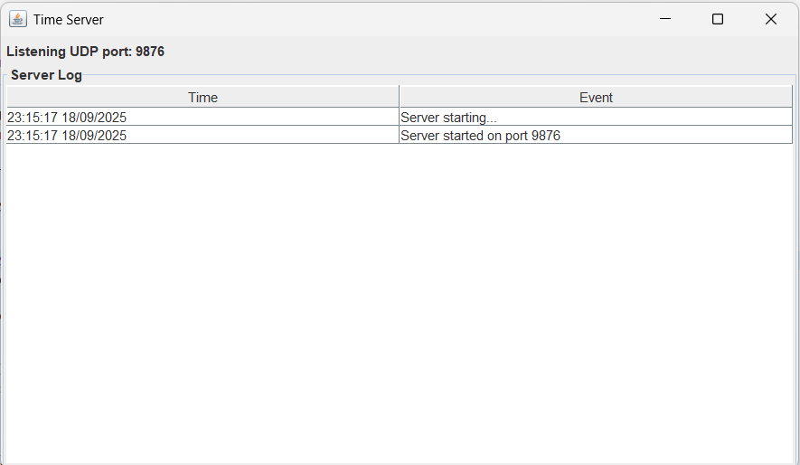
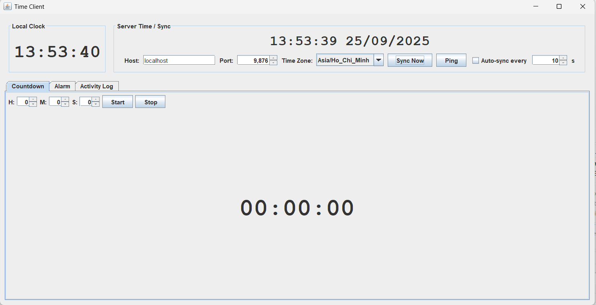
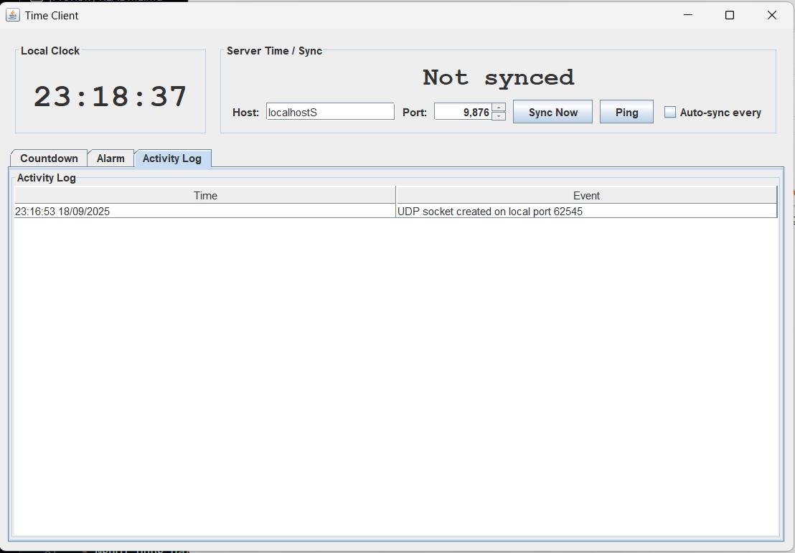
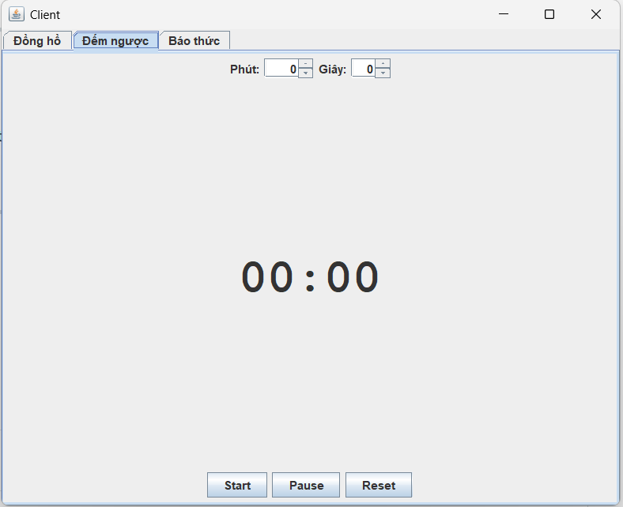

<h2 align="center">
    <a href="https://dainam.edu.vn/vi/khoa-cong-nghe-thong-tin">
    🎓 Faculty of Information Technology (DaiNam University)
    </a>
</h2>
<h2 align="center">
    ĐỒNG HỒ SERVER - CLIENT
</h2>
<div align="center">
    <p align="center">
        
        
        
    </p>

[](https://www.facebook.com/DNUAIoTLab)
[](https://dainam.edu.vn/vi/khoa-cong-nghe-thong-tin)
[](https://dainam.edu.vn)

</div>

---

## 📖 1. Giới thiệu hệ thống
Hệ thống được xây dựng nhằm mô phỏng ứng dụng **Client – Server đồng bộ thời gian** sử dụng **UDP (DatagramSocket, DatagramPacket)** kết hợp với **Java Swing** để tạo giao diện trực quan.  

- **Server**:  
  - Lắng nghe trên cổng `5000` bằng UDP.  
  - Khi nhận được gói tin `"TIME"` từ Client, server trả về thời gian hiện tại (HH:mm:ss).  
  - Hỗ trợ chức năng **⏳ đếm ngược (Countdown)** và **⏰ báo thức (Alarm)** chạy trực tiếp trên server.  
  - Ghi log hoạt động vào file `server.log`.  

- **Client**:  
  - Gửi gói tin `"TIME"` đến server để yêu cầu đồng bộ thời gian.  
  - Hiển thị đồng hồ thời gian thực và kết quả phản hồi từ server.  
  - Cho phép người dùng đặt **đếm ngược** và **báo thức** cục bộ qua giao diện.

  ## 🔧 2. Công nghệ sử dụng
   **Ngôn ngữ lập trình:** [](https://www.java.com/)
   - 🖥️ Java Swing: Thư viện giao diện đồ họa, hỗ trợ xây dựng các màn hình Client/Server trực quan.
   - 🌐 UDP Sockets (DatagramSocket, DatagramPacket): Cơ chế truyền thông tin giữa Client và Server theo mô hình phi kết nối.
   - 📝 File I/O (java.io, java.nio): Ghi log hoạt động của Server và đọc lại khi cần.

   ## 🖼️ 3. Hình ảnh các chức năng  

Dưới đây là một số giao diện chính của hệ thống:  

### 🖥️ Giao diện Server  
- Quản lý danh sách kết nối từ Client.  
- Hiển thị log hoạt động (kết nối, đồng bộ, báo thức).  

  

---

### 💻 Giao diện Client  
- Hiển thị thời gian thực được đồng bộ từ Server.  
- Cho phép người dùng thiết lập **báo thức** ⏰.  
- Tích hợp chức năng **bấm giờ** 🕐.  



---

### ⏰ Chức năng Báo thức  
- Người dùng đặt giờ báo thức.  
- Khi đến thời gian, hệ thống phát tín hiệu thông báo.  

  

---

### 🕐 Chức năng Đếm ngược  
- Hỗ trợ **Start – Pause – Reset**.  
- Dùng để đo thời gian cho các tác vụ cụ thể.  



## 4. Các bước cài đặt
### Yêu cầu hệ thống
- JDK 21 hoặc cao hơn
- Eclipse IDE (khuyến nghị bản mới nhất)
- Git đã cài trên máy

Bước 1: Clone project từ GitHub
```bash
git clone https://github.com/sam04cd/LTM-Gui-tin-nhan-Broadcast-qua-UDP.git
```
Bước 2: Import project vào Eclipse

- Mở Eclipse
- Vào File → Import
- Chọn Existing Projects into Workspace
- Chọn thư mục project vừa clone về
- Nhấn Finish

Bước 3: Kiểm tra môi trường

- Đảm bảo project chạy trên JavaSE-21 (hoặc phiên bản JDK bạn đã cài).
- Nếu thiếu thư viện, vào Project → Properties → Java Build Path để thêm JDK phù hợp.

Bước 4: Chạy ứng dụng

- Mở class Server → Run để khởi động server.
- Mở class Client → Run để khởi động client.
- Có thể mở nhiều client cùng lúc để test broadcast.

Bước 5: Gửi và nhận tin nhắn

- Nhập nội dung tin nhắn → nhấn Send.
- Tất cả client khác trong cùng mạng LAN sẽ nhận được tin nhắn broadcast.

## 5. Thông tin liên hệ

👨‍💻 Tác giả: Nguyễn Đức Tâm
📧 Email: tamn96911@gmail.com