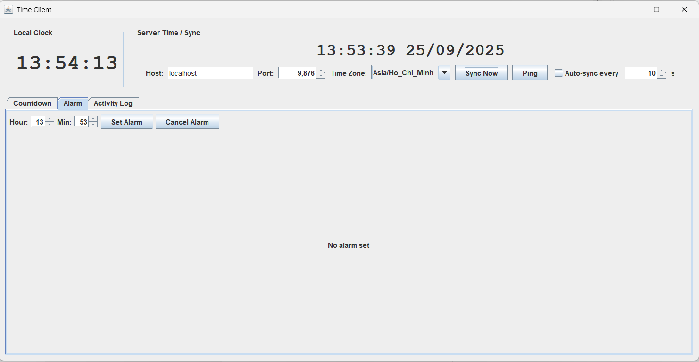

<h2 align="center">
    <a href="https://dainam.edu.vn/vi/khoa-cong-nghe-thong-tin">
    🎓 Faculty of Information Technology (DaiNam University)
    </a>
</h2>
<h2 align="center">
    ĐỒNG HỒ SERVER - CLIENT
</h2>
<div align="center">
    <p align="center">
        
        
        
    </p>

[](https://www.facebook.com/DNUAIoTLab)
[](https://dainam.edu.vn/vi/khoa-cong-nghe-thong-tin)
[](https://dainam.edu.vn)

</div>

---

## 📖 1. Giới thiệu hệ thống

Dự án này là một **ứng dụng mô phỏng hệ thống Client – Server đồng bộ thời gian** sử dụng **giao thức UDP** (User Datagram Protocol). Mục tiêu chính của dự án là minh họa và thực hành các khái niệm về truyền thông mạng, đồng bộ hóa thời gian trong hệ thống phân tán, cũng như thiết kế giao diện người dùng (GUI) đơn giản để quan sát hoạt động hệ thống.

### Tại sao cần đồng bộ thời gian?
Trong các hệ thống phân tán và mạng máy tính, việc **các nút có cùng mốc thời gian** là rất quan trọng cho:
- Ghi log chính xác theo thứ tự thời gian (troubleshooting, audit).
- Đồng bộ các tác vụ định kỳ (cron-like tasks).
- Giải quyết vấn đề bất đồng bộ giữa các bản ghi/transaction.

### Mô tả hệ thống
- **Server**:
  - Lắng nghe các yêu cầu đồng bộ thời gian từ nhiều Client qua UDP.
  - Trả về thời gian hệ thống hiện tại (theo định dạng chuẩn).
  - Ghi lại log các yêu cầu (thời gian nhận, địa chỉ Client, nội dung yêu cầu) vào file log để phục vụ kiểm tra.
  - Cung cấp giao diện Java Swing cho phép khởi động/dừng server, xem log, chọn cổng lắng nghe.
- **Client**:
  - Gửi yêu cầu đồng bộ đến Server (qua UDP).
  - Nhận phản hồi thời gian và cập nhật đồng hồ cục bộ (hoặc hiển thị thời gian Server).
  - Cung cấp GUI Java Swing để kết nối tới Server, hiển thị trạng thái, thực hiện lệnh Sync.

### Điểm nổi bật
- Sử dụng **UDP**: đơn giản, nhanh, phù hợp để minh họa các giao thức không kết nối.
- GUI (Java Swing) cho cả Server và Client: thân thiện, dễ sử dụng cho mục đích demo.
- Hỗ trợ nhiều Client kết nối cùng lúc để mô phỏng môi trường thực.
- Logging chi tiết trên Server (file + hiển thị GUI).


  ## 🔧 2. Công nghệ sử dụng
   **Ngôn ngữ lập trình:** [](https://www.java.com/)
- **Giao diện**: Java Swing  
- **Giao thức**: UDP (User Datagram Protocol)  
- **IDE khuyến nghị**: IntelliJ IDEA / Eclipse / NetBeans  
- **Hệ điều hành**: Windows / Linux / macOS  

   ## 🖼️ 3. Hình ảnh các chức năng  

Dưới đây là một số giao diện chính của hệ thống:  

### 🖥️ Giao diện Server  
- Quản lý danh sách kết nối từ Client.  
- Hiển thị log hoạt động (kết nối, đồng bộ, báo thức).  

  

---

### 💻 Giao diện Client và chức năng đếm ngược
- Hiển thị thời gian thực được đồng bộ từ Server.  
- Cho phép người dùng thiết lập **báo thức** ⏰.  
- Tích hợp chức năng **bấm giờ** 🕐.  


---

### ⏰ Chức năng Báo thức  
- Người dùng đặt giờ báo thức.  
- Khi đến thời gian, hệ thống phát tín hiệu thông báo.  

  

---

### 🕐 Chức năng ghi log
- Dùng để đo thời gian cho các tác vụ cụ thể.  


## 4. Các bước cài đặt

### Yêu cầu hệ thống

- **Java JDK**: Phiên bản 8 trở lên (khuyến nghị JDK 11 hoặc mới hơn).  
- **Git**: để tải mã nguồn từ GitHub.  
- **IDE (tùy chọn)**: IntelliJ IDEA / Eclipse / NetBeans (cũng có thể chạy trực tiếp bằng terminal).  
- **Hệ điều hành**: Windows / Linux / macOS.  

### Tải mã nguồn

Bước 1: Clone project từ GitHub
```bash
git clone https://github.com/ductam2594/dong-ho-Server-Client.git
```
Bước 2: Import project vào Eclipse

- Mở Eclipse
- Vào File → Import
- Chọn Existing Projects into Workspace
- Chọn thư mục project vừa clone về
- Nhấn Finish

Bước 3: Sau khi tải về, bạn sẽ có cấu trúc thư mục như sau:

/src
  /btl
    ClientGUI.java
    ServerGUI.java
    FileUtils.java
    Utils.java
/docs
  /images
    server_gui.png
    client_gui.png
README.md

Bước 4: Chạy ứng dụng

- Mở class Server → Run để khởi động server.
- Mở class Client → Run để khởi động client.
- Đồng bộ thời gian

Nhấn nút Sync Time trên Client.

Client sẽ gửi gói tin UDP đến Server.

Server phản hồi thời gian hệ thống hiện tại.

Client nhận phản hồi và cập nhật hiển thị đồng hồ.

- Ghi log

Server sẽ ghi lại tất cả các lần kết nối và phản hồi vào file log (ví dụ: logs/server_log.txt).

Log bao gồm: thời gian thực, IP của Client, cổng, nội dung yêu cầu và phản hồi.

- Tùy chỉnh

Cổng lắng nghe: có thể thay đổi trực tiếp trong GUI của Server trước khi nhấn Start.

Địa chỉ Server: trên Client nhập đúng IP máy chạy Server (cùng LAN hoặc Internet nếu mở cổng).

Nhiều Client: bạn có thể mở nhiều cửa sổ Client để kết nối đồng thời vào một Server.

## 5. Thông tin liên hệ

👨‍💻 Tác giả: Nguyễn Đức Tâm
📧 Email: tamn96911@gmail.com